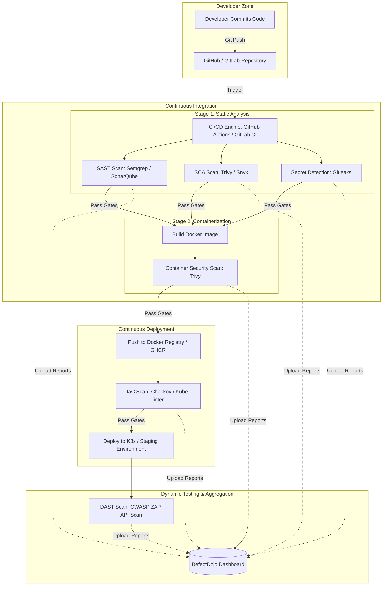

# Kế hoạch & Phân tích Đồ án Tốt nghiệp: Tự động hóa Security Scanning trong CI/CD cho Microservices

Chào bạn, đây là bản phân tích chi tiết và lộ trình nghiên cứu dành cho đồ án tốt nghiệp của bạn. Chủ đề **"Xây dựng quy trình tự động hóa kiểm tra lỗ hổng bảo mật (Security Scanning) trong chuỗi CI/CD cho các ứng dụng Microservices"** là một chủ đề rất thực tế, có tính ứng dụng cao và chuẩn xu thế **DevSecOps** hiện nay.

---

## 1. Phân Tích Chủ Đề & Khái Niệm Cốt Lõi

Để thực hiện tốt đồ án này, bạn cần làm chủ được 3 trụ cột kiến thức chính:

```
                  ┌──────────────────────────────────────────────┐
                  │                 ĐỒ ÁN TỐT NGHIỆP             │
                  └──────────────────────┬───────────────────────┘
                                         │
         ┌───────────────────────────────┼───────────────────────────────┐
         ▼                               ▼                               ▼
┌──────────────────┐           ┌──────────────────┐            ┌──────────────────┐
│   MICROSERVICES  │           │   CI/CD PIPELINE │            │SECURITY SCANNING │
│  - Container     │           │  - GitHub Actions│            │  - SAST & DAST   │
│  - API Gateway   │           │  - GitLab CI     │            │  - SCA & Container│
│  - Polyglot      │           │  - Jenkins       │            │  - IaC Scanning  │
└──────────────────┘           └──────────────────┘            └──────────────────┘
```

### Trụ cột 1: Ứng dụng Microservices
*   **Đặc điểm:** Ứng dụng được chia nhỏ thành nhiều service độc lập, chạy trong các **Docker Container**, thường được điều phối bởi **Kubernetes (K8s)**. Các service có thể được viết bằng nhiều ngôn ngữ khác nhau (Node.js, Java, Go, Python...) và giao tiếp qua API (REST, gRPC) hoặc Message Broker.
*   **Thách thức bảo mật:** 
    *   Bề mặt tấn công lớn (nhiều endpoint lộ ra ngoài).
    *   Phụ thuộc vào cấu hình container và hạ tầng (K8s/Docker).
    *   Nhiều repository code độc lập cần quét song song.

### Trụ cột 2: Chuỗi CI/CD (Continuous Integration / Continuous Delivery)
*   **Khái niệm:** Quy trình tự động hóa từ khi lập trình viên commit code, chạy test, build sản phẩm (Docker Image), cho đến khi deploy lên các môi trường.
*   **Nhiệm vụ:** Tích hợp các công cụ quét bảo mật vào các giai đoạn (stages) của pipeline một cách tự động mà không làm nghẽn (bottleneck) tốc độ deploy.

### Trụ cột 3: Kiểm tra lỗ hổng bảo mật (Shift-Left Security)
Thay vì đợi đến khi deploy lên Production mới kiểm tra bảo mật (Penetration Testing), quy trình DevSecOps thúc đẩy việc kiểm tra bảo mật càng sớm càng tốt (**Shift-Left**):
1.  **SAST (Static Application Security Testing):** Quét mã nguồn tĩnh để tìm lỗi logic bảo mật (như SQL Injection, Hardcoded secrets, XSS). *VD: Semgrep, SonarQube, Bandit.*
2.  **SCA (Software Composition Analysis):** Quét các thư viện bên thứ 3 (dependencies) xem có chứa các lỗ hổng đã được công bố (CVE - Common Vulnerabilities and Exposures) hay không. *VD: Trivy, Snyk, OWASP Dependency-Check.*
3.  **Container Scanning:** Quét Docker base image và các OS packages bên trong container để tìm lỗ hổng trước khi push lên Docker Registry. *VD: Trivy, Clair.*
4.  **IaC (Infrastructure as Code) Scanning:** Quét cấu hình Dockerfile, Kubernetes Manifests, Helm Charts, Terraform để phát hiện cấu hình sai (như chạy container bằng quyền root, mở port nguy hiểm). *VD: Checkov, Kube-linter, Tfsec.*
5.  **DAST (Dynamic Application Security Testing):** Quét ứng dụng đang chạy ở môi trường Staging/UAT để tìm lỗi bảo mật lúc runtime (như session handling, auth bypass). *VD: OWASP ZAP.*

---

## 2. Kiến Trúc Quy Trình Đề Xuất (DevSecOps Pipeline)

Dưới đây là mô hình kiến trúc một quy trình DevSecOps tự động hóa tiêu chuẩn mà bạn nên xây dựng trong đồ án:



### Điểm nhấn quan trọng trong đồ án (Thesis Highlights):
*   **Vulnerability Correlation (Tổng hợp lỗ hổng):** Việc sử dụng quá nhiều công cụ quét sẽ tạo ra rất nhiều file report rời rạc (JSON, XML). Bạn **bắt buộc** phải tích hợp một nền tảng quản lý lỗ hổng tập trung như **DefectDojo (Open Source)** để gộp các kết quả quét, lọc trùng (deduplication) và hiển thị dashboard trực quan.
*   **Security Gates (Rào cản bảo mật):** Thiết lập quy định: Nếu phát hiện lỗ hổng mức **Critical** hoặc **High**, pipeline sẽ tự động **FAILED** và chặn không cho deploy. Các lỗ hổng mức **Medium** hoặc **Low** thì chỉ cảnh báo và tạo Jira/GitHub Issue để sửa sau.

---

## 3. Lộ Trình Nghiên Cứu & Thực Hiện (Roadmap)

Dưới đây là lộ trình 6 bước chi tiết giúp bạn đi từ nghiên cứu lý thuyết đến xây dựng sản phẩm demo hoàn chỉnh để bảo vệ đồ án:

### Tuần 1 - 2: Nghiên cứu lý thuyết & Định hình đề tài
- [ ] Đọc các tài liệu về **DevSecOps**, **Shift-Left Security**, và tiêu chuẩn bảo mật **OWASP Top 10** (cả Web App và API).
- [ ] Tìm hiểu cơ chế hoạt động của các loại quét: SAST, SCA, Container scanning, IaC scanning, DAST.
- [ ] Viết đề cương nghiên cứu: Đặt vấn đề, mục tiêu, đối tượng nghiên cứu và kết quả mong đợi.

### Tuần 3 - 4: Xây dựng ứng dụng Microservices Demo
- [ ] Chọn một ứng dụng demo có kiến trúc Microservices đơn giản (Ví dụ: 1 API Gateway + 2-3 backend services viết bằng Python/Go/NodeJS + Database). Bạn có thể tự viết hoặc fork một project mẫu uy tín (như *Google Microservices Demo* hoặc *Sock Shop*).
- [ ] Container hóa tất cả các services bằng Docker. Xây dựng file `docker-compose.yml` hoặc Kubernetes manifests để chạy local.
- [ ] **Quan trọng:** Cố ý để lại một số lỗ hổng kinh điển trong code/thư viện (ví dụ: dùng thư viện npm cũ có lỗi CVE, code có lỗi SQL Injection, hoặc để lộ API Key trong Dockerfile) để làm đối chứng thử nghiệm cho các công cụ quét bảo mật sau này.

### Tuần 5 - 6: Cài đặt và tích hợp các công cụ quét (CI Stage)
- [ ] Chọn nền tảng CI/CD: Khuyên dùng **GitHub Actions** hoặc **GitLab CI** (miễn phí, dễ dùng và cấu hình bằng YAML).
- [ ] Cấu hình các công việc quét (CI Jobs) song song:
    *   **Secret Detection:** Tích hợp **Gitleaks** để phát hiện việc lỡ commit private key, API key lên repository.
    *   **SAST:** Tích hợp **Semgrep** (nhẹ, nhanh) hoặc **SonarQube** để quét mã nguồn.
    *   **SCA:** Tích hợp **Trivy** hoặc **OWASP Dependency-Check** quét `package.json`/`requirements.txt`/`go.mod`.
- [ ] Cấu hình job Build Docker Image và chạy **Trivy** để quét Docker Image vừa build.

### Tuần 7 - 8: Tích hợp CD, IaC & DAST
- [ ] Viết các file cấu hình Infrastructure as Code (ví dụ: Kubernetes manifests).
- [ ] Tích hợp **Checkov** hoặc **Kube-linter** vào pipeline để quét lỗi cấu hình IaC trước khi deploy.
- [ ] Cài đặt môi trường deploy (có thể giả lập bằng Minikube hoặc K3s trên VPS/Local).
- [ ] Tích hợp công cụ **DAST** (như **OWASP ZAP** phiên bản chạy CLI/Docker) để quét các API endpoints của Microservices sau khi đã deploy lên môi trường test.

### Tuần 9 - 10: Xây dựng Dashboard quản lý lỗ hổng tập trung
- [ ] Triển khai **DefectDojo** (thường chạy qua Docker Compose).
- [ ] Viết script (Python/Bash) hoặc dùng API của DefectDojo để tự động đẩy kết quả quét (file JSON/XML từ Trivy, Semgrep, ZAP...) lên DefectDojo sau mỗi lượt chạy pipeline kết thúc thành công/thất bại.
- [ ] Cấu hình hệ thống cảnh báo (Slack / Telegram / Email Notification) gửi tin nhắn khi phát hiện lỗ hổng nghiêm trọng.

### Tuần 11 - 12: Đánh giá, Viết báo cáo & Chuẩn bị bảo vệ
- [ ] Chạy thực nghiệm: Chạy pipeline nhiều lần, đo đạc thời gian chạy của từng tool quét.
- [ ] Đánh giá độ chính xác (tỷ lệ False Positive - báo cáo sai, False Negative - bỏ sót lỗi).
- [ ] Viết tài liệu đồ án tốt nghiệp (Thesis):
    *   Chương 1: Mở đầu & Cơ sở lý thuyết.
    *   Chương 2: Thiết kế kiến trúc hệ thống tự động hóa.
    *   Chương 3: Triển khai thực nghiệm (Demo).
    *   Chương 4: Kết quả đạt được, đánh giá hạn chế và hướng phát triển.
- [ ] Chuẩn bị slide slide thuyết trình và quay video demo chạy pipeline thực tế làm backup khi bảo vệ trực tiếp.

---

## 4. Gợi Ý Các Công Cụ Phù Hợp Cho Đồ Án (Tech Stack tuyển chọn)

Để đồ án của bạn dễ làm, ổn định và được thầy cô đánh giá cao về độ cập nhật công nghệ, hãy sử dụng các công cụ sau:

| Loại quét | Công cụ đề xuất | Lý do chọn |
| :--- | :--- | :--- |
| **CI/CD Platform** | **GitHub Actions** hoặc **GitLab CI** | Hiện đại, viết bằng YAML, dễ cấu hình runners miễn phí, hỗ trợ nhiều plugin bảo mật có sẵn. |
| **Secret Scanning** | **Gitleaks** | Chạy nhanh, nhẹ, định nghĩa rules bằng regex rất trực quan để quét mã độc/secrets. |
| **SAST** | **Semgrep** | Rất nhanh, hỗ trợ đa ngôn ngữ, viết rule tùy biến (custom rules) dễ dàng. Đồ án sẽ rất điểm cộng nếu bạn viết được một vài custom rules phù hợp với dự án. |
| **SCA** | **Trivy** hoặc **Snyk** | Trivy quét cực nhanh, xuất ra nhiều định dạng (JSON, JUnit, CycloneDX SBOM). |
| **Container Scan**| **Trivy** | Tiêu chuẩn công nghiệp hiện nay, database cập nhật liên tục. |
| **IaC Scan** | **Checkov** | Quét tốt cả Dockerfile, Kubernetes Manifests, Terraform. |
| **DAST** | **OWASP ZAP API Scan** | Phù hợp với kiến trúc API của Microservices. |
| **Vulnerability Hub**| **DefectDojo** | Có giao diện web đẹp, quản lý phân quyền, hỗ trợ import báo cáo của hơn 100 công cụ bảo mật khác nhau, tự động lọc trùng. |

---

## 5. Những "Điểm Cộng" Giúp Đạt Điểm A/A+ Cho Đồ Án

Nếu chỉ cài đặt các công cụ chạy tuần tự, đồ án của bạn sẽ chỉ ở mức Khá. Để đạt điểm **Xuất sắc (A+)**, hãy cân nhắc thêm các yếu tố sau:

1.  **Chính sách Phê Duyệt Lỗ Hổng (Vulnerability Exception Workflow):** Trong thực tế, có những lỗi bảo mật là "False Positive" (báo sai) hoặc không thể sửa ngay được. Xây dựng quy trình cho phép Security Engineer phê duyệt (Accept risk / False Positive) trên DefectDojo để lần quét sau pipeline không bị chặn.
2.  **Quản lý SBOM (Software Bill of Materials):** Xu hướng bảo mật chuỗi cung ứng phần mềm (Software Supply Chain Security) đang rất nóng. Hãy cấu hình Trivy xuất ra file SBOM định dạng CycloneDX/SPDX để quản lý nguồn gốc tất cả các package.
3.  **Tối ưu hóa thời gian chạy pipeline (Caching & Parallelism):** Quét DAST và SAST có thể mất 15-30 phút. Giải thích cách bạn tối ưu (ví dụ: quét SAST/SCA song song, cache database của Trivy để không phải download lại mỗi lần chạy, chạy DAST không đồng bộ hoặc chỉ chạy định kỳ hàng đêm thay vì mọi commit).
4.  **Tạo Custom Rule cho SAST:** Viết riêng 1-2 luật quét (custom rule bằng YAML của Semgrep) để quét một lỗ hổng logic đặc thù trong ứng dụng của bạn. Điều này chứng minh bạn hiểu sâu cơ chế hoạt động của công cụ quét chứ không chỉ đi "cài đặt ăn sẵn".
